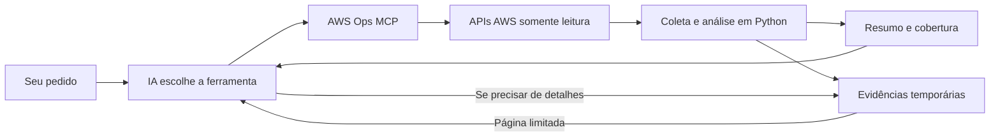

# AWS Ops MCP

**Peça uma análise da AWS em linguagem natural. O MCP coleta os dados, executa verificações em código e entrega à IA um resumo com evidências.**

O objetivo é transformar investigações repetitivas em ferramentas reutilizáveis: menos resultados extensos na conversa e uma forma consistente de verificar seus ambientes.

**Hoje:** inventário e verificações de saúde EC2, somente leitura, em contas configuradas. Primeira versão implementada e validada por 20 testes offline; conexão com conta AWS real e configuração do cliente MCP ainda pendentes.

## O que você pode pedir hoje

Após configurar uma conta com o alias `sandbox` e conectar um cliente de IA compatível com MCP local:

| Seu pedido à IA | O que acontece | O que você recebe |
|---|---|---|
| “Quais análises você consegue executar?” | IA chama `capabilities` | Capacidades e limites realmente implementados |
| “Faça um inventário EC2 da sandbox em us-east-1.” | MCP consulta as páginas da API e resume os estados | Quantidade observada, estados e amostra das instâncias |
| “Verifique os status checks das EC2 nessa conta e região.” | MCP avalia checks de instância, sistema, EBS quando disponível e eventos agendados | Falhas observadas e verificações que não puderam ser concluídas |
| “Mostre mais instâncias do último inventário.” | IA consulta `evidence_get` usando o identificador retornado | Mais registros normalizados, sem refazer a coleta enquanto o cache estiver disponível |
| “Repita a análise na conta de homologação.” | IA chama a ferramenta com outro alias configurado | Nova consulta isolada por conta e região, com AssumeRole quando configurado |

A IA entende o pedido e escolhe a ferramenta. O MCP recebe parâmetros definidos, como conta e região. Cada consulta cobre uma conta e uma região; uma comparação entre ambientes exige chamadas separadas e interpretação pela IA.

## Onde está o ganho

Uma investigação manual pode colocar páginas de respostas AWS no contexto da IA. Aqui, Python faz a coleta, seleciona campos e aplica regras antes de devolver os resultados.



| Benefício | Como esta versão entrega |
|---|---|
| Menos texto no contexto | Resumo limitado; detalhes recuperados em páginas conforme a necessidade |
| Verificações consistentes | As mesmas regras em código são aplicadas a cada execução |
| Uso entre contas | Aliases, profiles e AssumeRole opcional; conta efetiva conferida antes da coleta |
| Limitações visíveis | Erros, paginação incompleta e checks indisponíveis aparecem na resposta |
| Reutilização entre IAs | Ferramentas expostas via MCP stdio; cada cliente precisa suportar e configurar esse transporte |
| Crescimento por demanda | Novas análises podem reaproveitar autenticação, limites e evidências existentes |

Não há chamada a um LLM dentro deste servidor. A IA utilizada pelo cliente continua responsável pela conversa e pela interpretação que ultrapassa as regras implementadas.

### Economia já medida

No [benchmark sintético registrado](docs/validation.md), usando as mesmas 1.000 instâncias:

| Conteúdo | Tamanho |
|---|---:|
| Lista normalizada completa | 150.000 bytes |
| Resumo com metadados e amostra | 3.633 bytes |
| Redução do payload | **97,58%** |

Isso mede bytes, **não tokens nem redução da fatura**. O resultado depende do volume, da análise e dos detalhes solicitados depois. Schemas das ferramentas, pedidos da IA e páginas adicionais também ocupam contexto. Com poucos recursos, os metadados do resumo podem superar o tamanho da lista original.

## Como interpretar uma análise

Exemplo ilustrativo, abreviado; não corresponde a uma conta real:

```json
{
  "account": "sandbox",
  "region": "us-east-1",
  "status": "degraded",
  "summary": {
    "observed_instances": 12,
    "counts_complete": true,
    "states": {"running": 10, "stopped": 2},
    "finding_count": 1,
    "unassessable_instances": 0
  },
  "findings": [
    {
      "instance_id": "i-00000000000000001",
      "code": "status_check_failed",
      "checks": ["system"]
    }
  ]
}
```

A IA pode explicar: “Foram observadas 12 instâncias. Uma apresentou falha no status check de sistema.” Isso identifica o sinal observado; determinar sua causa pode exigir uma análise ainda não implementada.

| Status | Significado |
|---|---|
| `ok` | As verificações declaradas foram concluídas sem achados; não garante saúde de toda a aplicação |
| `degraded` | A análise encontrou falhas ou eventos que merecem atenção |
| `partial` | Parte da coleta ou da análise ficou incompleta; achados já obtidos são preservados |
| `error` | A consulta não pôde ser concluída, por exemplo por configuração inválida ou acesso negado antes de receber páginas |

Uma amostra curta não implica coleta incompleta: `coverage` diferencia truncamento da apresentação e lacunas na coleta. Uma ferramenta inexistente gera erro do protocolo; `capabilities` informa o que está disponível.

## Como cresce quando faltar uma capacidade

**A expansão é assistida por um agente desenvolvedor com acesso ao projeto.** O servidor não escreve nem instala módulos sozinho.

| Situação | Caminho |
|---|---|
| A análise já existe | Executar a ferramenta |
| Os dados existem, mas a interpretação é nova | IA consulta evidências e apresenta sua inferência; pode haver proposta para transformar a análise em rotina |
| Existe o módulo, mas faltam dados ou regras | Agente amplia coletor/analisador e adiciona testes |
| O serviço ainda não existe | Agente implementa um módulo e registra suas ferramentas após validar |

Exemplo: “Verifique o atraso de replicação do RDS.” Hoje, esse pedido está fora das capacidades. O próximo trabalho seria definir as métricas necessárias, implementar a análise, testar e atualizar o catálogo. Só então a nova ferramenta seria disponibilizada, após reiniciar o servidor e reconectar o cliente.

A primeira implementação consome trabalho e tokens; as próximas execuções podem reaproveitar esse código. A criação de um módulo não concede permissões AWS. Veja o [procedimento de expansão](docs/extension-workflow.md).

## Potencial de evolução

Estas são possibilidades do projeto, **ainda não implementadas e sem ordem de entrega definida**:

| Módulo futuro | Exemplos de análise |
|---|---|
| EKS / Karpenter | Nodes, pods pendentes e sinais relacionados ao provisionamento Spot |
| RDS / ElastiCache / OpenSearch | Saúde e métricas específicas de cada serviço |
| Custos | Gastos por conta/serviço e variações de custo |
| Rede / IAM | Verificações de configuração e permissões dentro de um escopo definido |
| Terraform | Verificação de drift com acesso ao projeto e ao estado |
| Rotinas agendadas | Executar verificações determinísticas sem IA e encaminhar exceções para análise |

**Limite atual:** esta versão consulta EC2. Não altera infraestrutura, não corrige falhas automaticamente, não monitora continuamente e não executa comandos genéricos. Não inclui métricas CloudWatch, diagnóstico completo de aplicações ou suporte universal à AWS.

## Ferramentas

| Ferramenta | Resultado |
|---|---|
| `capabilities` | Serviços, análises e limites implementados; sem AWS |
| `ec2_inventory(account, region)` | Totais observados por estado e até 20 instâncias |
| `ec2_health(account, region)` | Estado, status checks e eventos agendados EC2 |
| `evidence_get(evidence_id, offset=0, limit=50)` | Página de evidências normalizadas da mesma sessão |

Saúde EC2 não inclui aplicações, conectividade, CloudWatch ou histórico. Conta vazia é diferente de consulta sem permissão. Instância parada não é automaticamente um problema. Status checks indisponíveis em instâncias em execução geram cobertura parcial.

## Instalação no Windows

Python 3.11 ou superior. Execute dentro desta pasta:

```powershell
python -m venv .venv
.\.venv\Scripts\python.exe -m pip install -e '.[dev]'
Copy-Item config\accounts.example.json accounts.local.json
```

Edite `accounts.local.json` com aliases, IDs esperados, profiles já configurados e regiões permitidas. Os IDs do exemplo são fictícios. Remova a entrada de AssumeRole se não for utilizá-la. Não coloque chaves no arquivo.

```powershell
$env:AWS_OPS_CONFIG = (Resolve-Path accounts.local.json).Path
.\.venv\Scripts\python.exe -m aws_ops_mcp.server
```

O processo aguarda mensagens MCP em stdin; não é um chat de terminal. O cliente MCP normalmente inicia esse comando. Credenciais e login SSO são preparados externamente. O servidor verifica a conta efetiva antes de consultar EC2 e não faz fallback para outra conta ou região.

O ambiente de desenvolvimento usa a linha MCP SDK 1.x com limite `<2`, sem migração implícita de API. A fotografia de dependências testadas está em `requirements-dev.lock.txt` (Windows/Python 3.13); instalação reproduzível nesse ambiente: `pip install -r requirements-dev.lock.txt`, seguida de `pip install --no-deps -e .`. Em outros sistemas, use o pyproject.

## Conectar a um cliente MCP local

Configure transporte stdio com o executável Python do ambiente e os argumentos abaixo. Substitua os caminhos; a configuração exata depende do cliente. Nenhum cliente foi configurado automaticamente.

```json
{
  "mcpServers": {
    "aws-ops-mcp": {
      "command": "C:/caminho/mcps/aws-ops-mcp/.venv/Scripts/python.exe",
      "args": ["-m", "aws_ops_mcp.server"],
      "env": {
        "AWS_OPS_CONFIG": "C:/caminho/mcps/aws-ops-mcp/accounts.local.json"
      }
    }
  }
}
```

Primeiro chame `capabilities`. Depois use, por exemplo, `ec2_inventory(account="sandbox", region="us-east-1")`, com alias existente na sua configuração.

## Permissões

[Política EC2 de exemplo](config/ec2-readonly-policy.json): `ec2:DescribeInstances` e `ec2:DescribeInstanceStatus`. Ambas usam `Resource: "*"`; restrinja regiões por configuração e, se desejado, pela política organizacional.

O servidor também chama STS `GetCallerIdentity` para conferir a conta. Para AssumeRole, o principal de origem precisa de `sts:AssumeRole` no ARN de destino e a trust policy da role deve aceitar esse principal. A role de destino precisa das permissões EC2. As políticas não são criadas ou aplicadas pelo MCP. ExternalId/MFA interativo para AssumeRole não fazem parte desta versão; use um profile externo adequado quando necessário.

## Limites e dados

- Resumo JSON até 12 KiB; no máximo 20 amostras e 20 achados, com totais separados. O conteúdo é enviado uma única vez como texto JSON, sem duplicação em `structuredContent`.
- Evidências até 50 itens e 24 KiB por página. Use `next_offset`; cache em memória, TTL de 15 minutos, até 100 consultas e 20 MiB. Reiniciar o servidor apaga o cache.
- Coleta até 100 páginas, 10.000 instâncias e 60 segundos, incluindo autenticação. Processo isolado encerrado no deadline; limpeza pode acrescentar até dois segundos. Páginas já recebidas são preservadas.
- Resultados parciais têm contagens observadas, não totais globais. `coverage` distingue paginação, checks e truncamento da apresentação. Paginação AWS não constitui snapshot transacional.
- Apenas campos selecionados são retidos; sem tags, user data ou mensagens brutas de erro. IDs de recursos enviados ao cliente/IA ainda são dados da conta.
- Servidor local de usuário único; IDs de evidências não substituem autorização. Não expor como serviço remoto compartilhado.
- A evidência cobre campos normalizados, não uma cópia integral da resposta AWS. Eventos são limitados a 20 por instância, com truncamento explícito.

## Testar e medir

```powershell
.\.venv\Scripts\python.exe -m pytest -q
.\.venv\Scripts\python.exe scripts\measure_payload.py
```

O benchmark compara 1.000 instâncias sintéticas normalizadas com o resumo das mesmas instâncias. Mede bytes do payload, não tokens, custo total da conversa ou ganho garantido. Consultas adicionais de evidência e schemas das ferramentas também consomem contexto.

## Ampliar

Siga o [procedimento de expansão assistida](docs/extension-workflow.md). O servidor executa código aprovado; o agente desenvolvedor adiciona módulos e análises. O MCP não altera seu código nem concede permissões por conta própria.

## Referências verificadas

- [Especificação e decisões](docs/superpowers/specs/2026-09-24-aws-ops-mcp-design.md)
- [Resultados da validação](docs/validation.md)
- [Contexto original](docs/contexto-original.txt)
- [Instruções e histórico](AGENTS.md)

- [SDK MCP Python, linha 1.x](https://github.com/modelcontextprotocol/python-sdk/tree/v1.x)
- [AWS DescribeInstanceStatus](https://docs.aws.amazon.com/boto3/latest/reference/services/ec2/client/describe_instance_status.html)
- [AWS AssumeRole](https://docs.aws.amazon.com/boto3/latest/reference/services/sts/client/assume_role.html)
